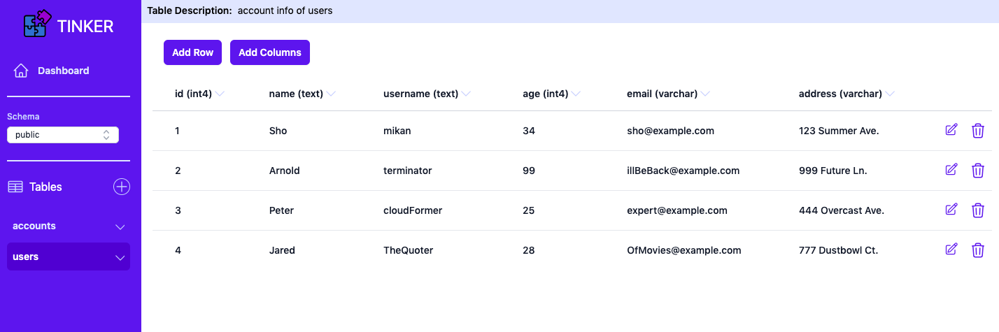
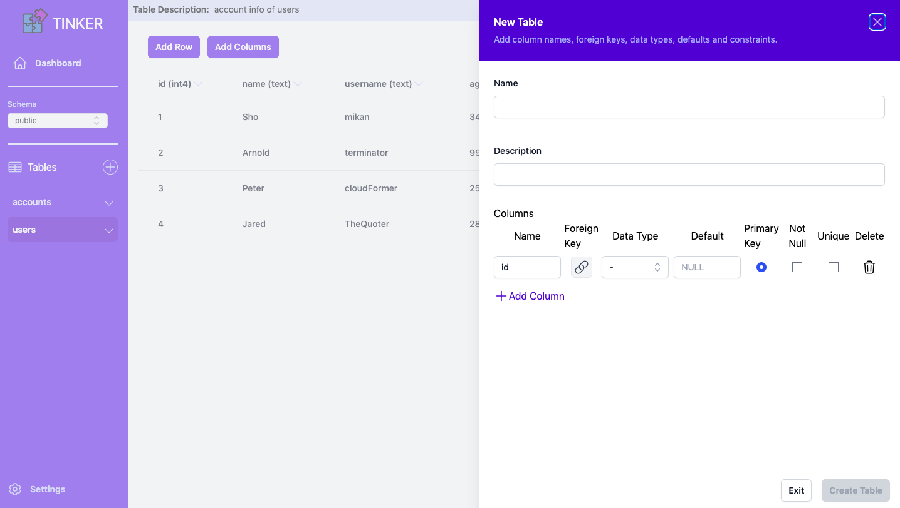
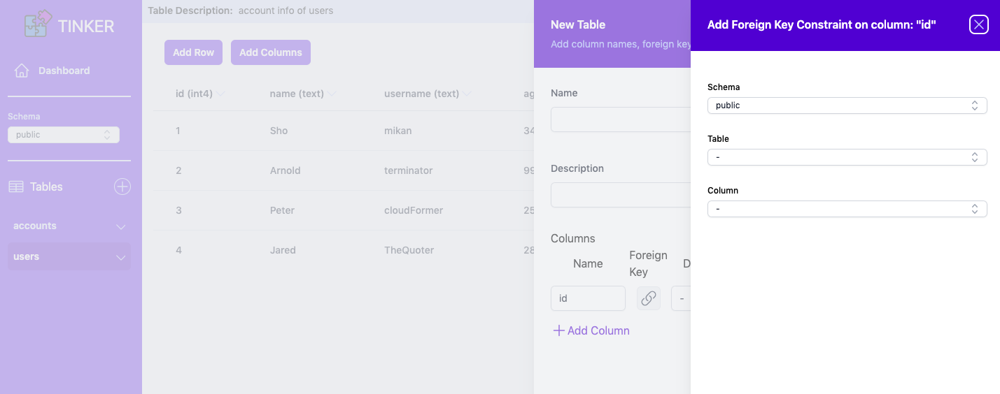
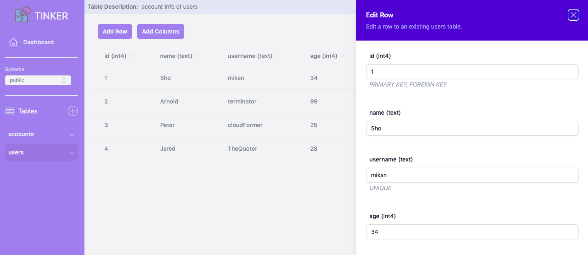
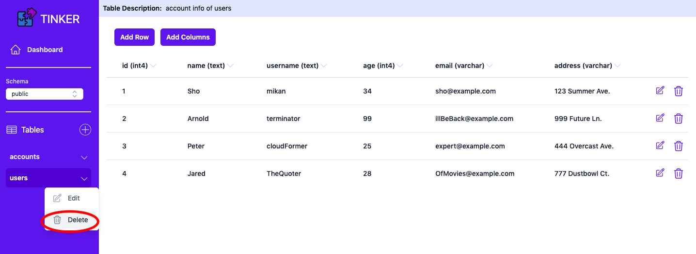
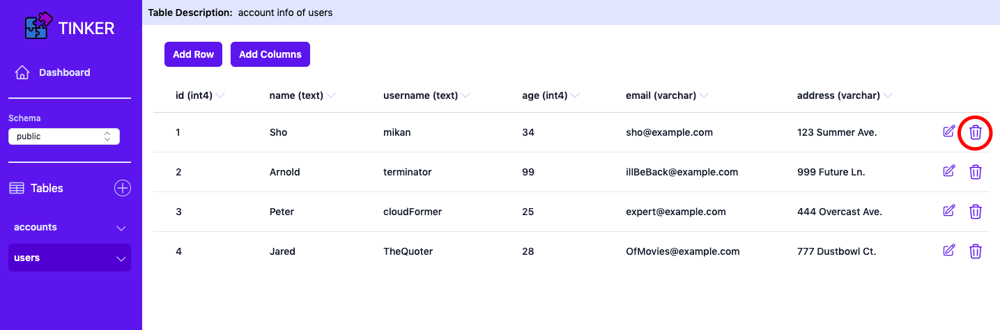

  

# Tinker

> Tinker automates the creation of backends for your web applications.

- [Overview](#overview)
- [Dashboard](#dashboard)
- [Usage](#usage)

## Overview

Tinker is an open-source, self-hosted, backend-as-a-service. Each backend includes a PostgreSQL database and REST API to start prototyping your web application.

Create public facing backends with minimal configuration in your AWS account through the Tinker CLI. Visualize and modify your application's data and schema with the companion Tinker dashboard.

## Dashboard

The dashboard UI displays all active backends in your Tinker deployment. Each backend is interactive — view and alter the data associated with your backends. The dashboard essentially acts as an interface to your backend's PostgreSQL database.

## Usage

The dashboard simplifies working with PostgreSQL by providing commonly used SQL commands through a graphical interface.

### View Backends

  

### View Tables

  

### Create Tables

  

### Foreign Keys

  

### Insert Rows

  

### Update Row

  

### Deletions

  

  

  

